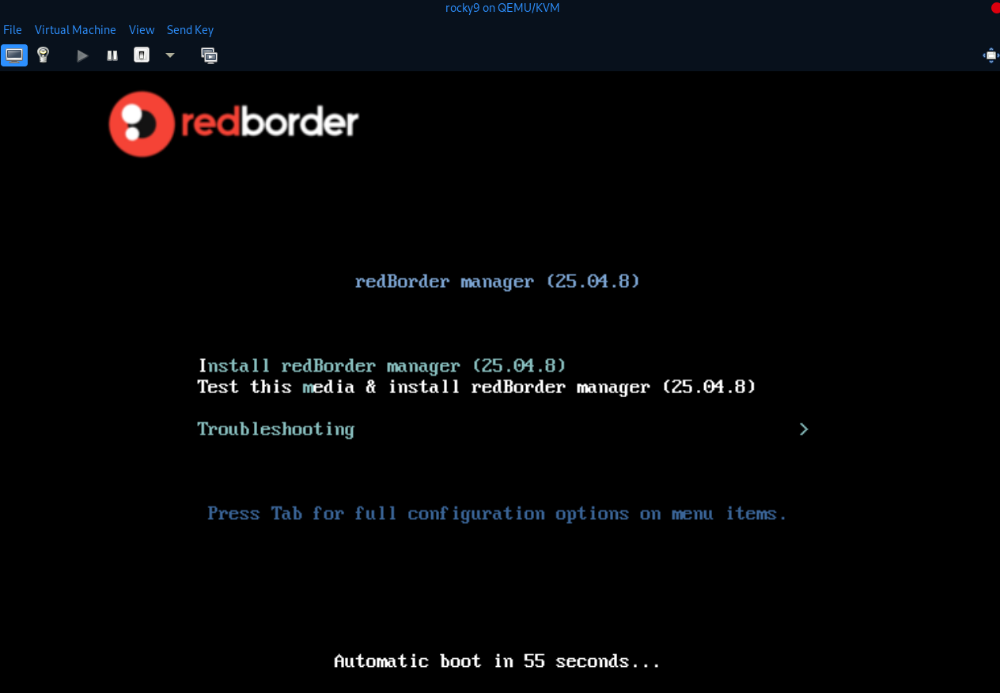
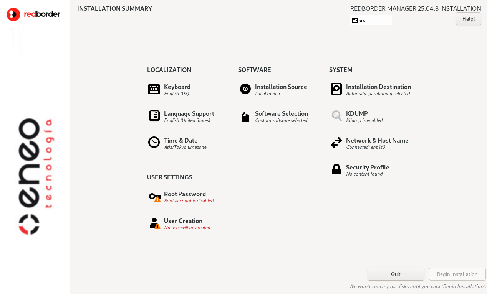
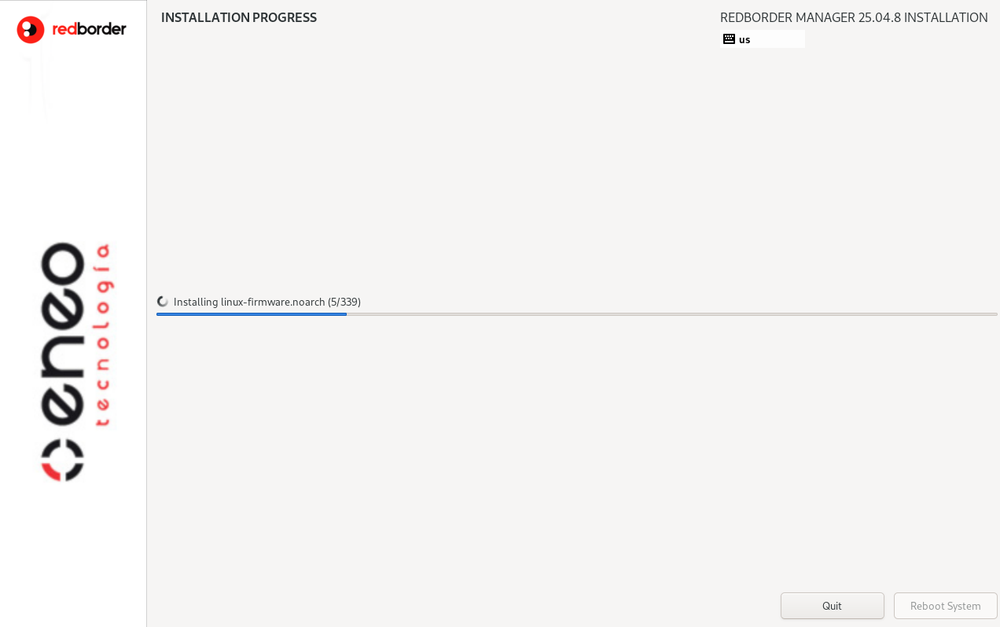

# redBorder NG ISO Creator

This project provides an automated script to generate a customized redBorder ISO based on Rocky Linux 9. 
It patches bootloader & anaconda, and add custom images
The resulting ISO includes a predefined redBorder product type (e.g., manager, IPS, intrusion, or proxy), custom splash images, and a local package repository.

# Examples





```bash
malvads ::/iso-creator » sudo ./build_ng_iso.sh 
[sudo] password for malvads: 
Fetching redBorder release versions...
1) latest      3) 24.12.1    5) 25.01.10   7) 25.01.11   9) 25.04.4   11) 25.04.5   13) 25.04.6   15) 25.04.7   17) 25.04.8
2) 24.12.1     4) 25.01.10   6) 25.01.11   8) 25.04.4   10) 25.04.5   12) 25.04.6   14) 25.04.7   16) 25.04.8

Select redBorder release version (default is "latest"): 16
Fetching RPM for selected version...
1) manager
2) ips
3) intrusion
4) proxy

```
## Author

**Miguel Álvarez**  
<malvarez@redborder.com>

## License

SPDX-License-Identifier: AGPL-3.0-or-later

---

## Features

- Interactive selection of redBorder version and product type.
- Automatic download and installation of required tools.
- Integration of redBorder repository and all required RPMs.
- Custom Kickstart generation.
- Bootloader customization.
- Injection of custom Anaconda splash screen and product info.
- Local repository building.
- Final ISO creation compatible with EFI and legacy boot.

## Requirements

Make sure the following tools are installed (the script attempts to install them automatically via `dnf`):

- `squashfs-tools`
- `xorriso`
- `rsync`
- `createrepo`
- `dnf-plugins-core`
- `xmlstarlet`
- `syslinux`
- `lorax`
- `rpmdevtools`
- `curl`

## Usage

```bash
./build-ng-iso.sh
